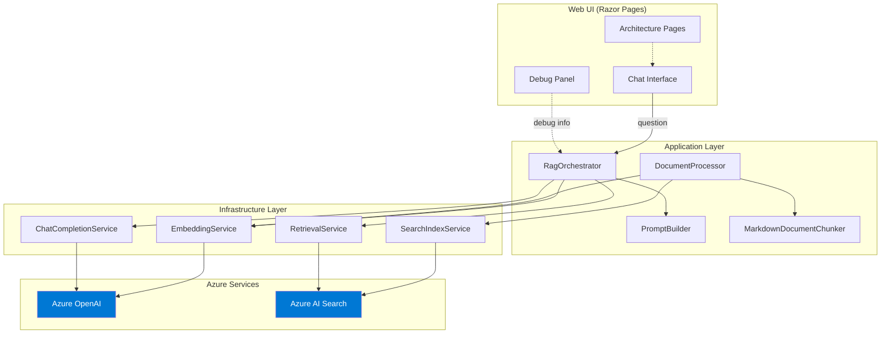

# RAG Navigator

[](https://github.com/ArtemSemenov/rag-navigator/actions/workflows/ci.yml)

**Engineering Knowledge Assistant** — A code-first Retrieval-Augmented Generation (RAG) application built with .NET, Azure OpenAI, and Azure AI Search.

This project demonstrates two capabilities:
1. **Azure GenAI / RAG implementation** — a complete, working RAG pipeline with direct Azure SDK usage
2. **Solution architecture** — comprehensive architecture documentation, design decisions, and production-readiness thinking

Every pipeline step (chunking, embedding, retrieval, prompt construction, answer generation, citation extraction) is fully visible in the code — no black-box orchestration frameworks.

## Architecture



### Data Flow

**Query Pipeline:**
```
User Question → Embed Query → Hybrid Search (keyword + vector, RRF fusion) → Grounded Prompt → LLM Answer → Citations
```

**Ingestion Pipeline:**
```
Files (.md/.txt) → Heading-aware Chunking → Batch Embedding → Index Schema Creation → Upload to Azure AI Search
```

## Key Design Decisions

| Decision | Rationale | ADR |
|----------|-----------|-----|
| **Modular monolith** | Right-sized for scope; clean internal boundaries without distributed system complexity | [ADR-001](docs/architecture/20-adr-001-modular-monolith.md) |
| **Code-first RAG** | Direct SDK usage makes every pipeline step visible and explainable | [ADR-002](docs/architecture/21-adr-002-classic-rag.md) |
| **Hybrid retrieval** | BM25 keyword + HNSW vector, merged by RRF — captures both exact terms and semantic similarity | [ADR-003](docs/architecture/22-adr-003-hybrid-retrieval.md) |
| **Docs as corpus** | Architecture docs are indexed so the system can answer questions about its own design | [ADR-004](docs/architecture/23-adr-004-docs-as-corpus.md) |

## Features

- **Document ingestion** — markdown-aware semantic chunking (heading-split, 1500-char max, 200-char overlap)
- **Hybrid retrieval** — BM25 keyword + HNSW vector search, merged by Reciprocal Rank Fusion
- **Grounded answers** — explicit citations with source file, section, and evidence snippets
- **Debug mode** — inspect retrieved chunks, relevance scores, and the full prompt
- **Architecture pages** — built-in UI for architecture overview, ADRs, and operational runbook
- **Self-documenting** — the system indexes and answers questions about its own architecture
- **Programmatic index** — search index schema created from code, not Azure Portal
- **Clean architecture** — interfaces, dependency injection, three-layer separation

## Project Structure

```
RAGNavigator/
├── src/
│   ├── Application/          # Domain logic — zero Azure dependencies
│   │   ├── Interfaces/       # IDocumentChunker, IEmbeddingService, etc.
│   │   ├── Models/           # DocumentChunk, RetrievalResult, ChatResponse
│   │   └── Services/         # Chunker, PromptBuilder, Orchestrators
│   ├── Infrastructure/       # Azure SDK implementations
│   │   ├── AI/               # Azure OpenAI (embeddings + chat)
│   │   ├── Search/           # Azure AI Search (index + retrieval)
│   │   └── Configuration/    # Strongly-typed options with validation
│   └── Web/                  # ASP.NET Core Razor Pages + Minimal API
│       └── Pages/            # Chat, Architecture, Decisions, Operations
├── tests/                    # xUnit tests (chunking + prompt assembly)
├── sample-data/              # Engineering documents (ADRs, runbooks, postmortems)
├── docs/architecture/        # 26 architecture documents (also indexed as corpus)
└── RAGNavigator.sln
```

## Architecture Documentation

The `docs/architecture/` folder contains a complete solution architecture package:

| Document | Description |
|----------|-------------|
| [00 Solution Overview](docs/architecture/00-solution-overview.md) | Business context, goals, scope, trade-offs |
| [01 Functional Requirements](docs/architecture/01-functional-requirements.md) | Use cases, user journeys, data flows |
| [02 Non-Functional Requirements](docs/architecture/02-non-functional-requirements.md) | Availability, latency, security, scalability, cost |
| [03 Context Diagram](docs/architecture/03-context-diagram.md) | System context with actors and boundaries |
| [04 Container Diagram](docs/architecture/04-container-diagram.md) | Container-level architecture |
| [05 Component Diagram](docs/architecture/05-component-diagram.md) | Internal components and dependencies |
| [06 Query Sequence](docs/architecture/06-query-sequence.md) | End-to-end question answering flow |
| [07 Ingestion Sequence](docs/architecture/07-ingestion-sequence.md) | Document ingestion pipeline |
| [08 Deployment Topology](docs/architecture/08-deployment-topology.md) | Local dev, Azure target, network hardening |
| [09 Data Model](docs/architecture/09-data-model.md) | All domain models and their relationships |
| [10 Search Index Schema](docs/architecture/10-search-index-schema.md) | Azure AI Search field definitions and rationale |
| [11 Security & Threat Model](docs/architecture/11-security-and-threat-model.md) | Trust boundaries, threats, mitigations |
| [12 Identity & Access](docs/architecture/12-identity-and-access.md) | Auth strategy, RBAC, managed identity |
| [13 Reliability & Resilience](docs/architecture/13-reliability-and-resilience.md) | Retries, timeouts, failure handling |
| [14 Observability](docs/architecture/14-observability.md) | Logging, metrics, tracing, alerting |
| [15 Performance & Scale](docs/architecture/15-performance-and-scale.md) | Bottlenecks, latency breakdown, scaling path |
| [16 Cost Considerations](docs/architecture/16-cost-considerations.md) | Cost drivers, estimates, optimization |
| [17 CI/CD & Release](docs/architecture/17-ci-cd-and-release-strategy.md) | Pipeline design, environments, rollback |
| [18 Operations Runbook](docs/architecture/18-operations-runbook.md) | Reindexing, troubleshooting, validation |
| [19 Architecture Decisions](docs/architecture/19-architecture-decisions.md) | Decision summary and principles |
| [20-23 ADRs](docs/architecture/20-adr-001-modular-monolith.md) | Four detailed architecture decision records |
| [24 Well-Architected Review](docs/architecture/24-well-architected-review.md) | Azure WAF assessment across 5 pillars |
| [25 Demo Walkthrough](docs/architecture/25-demo-walkthrough.md) | 5-minute interview demo script |

All architecture documents are indexed as part of the RAG corpus — the assistant can answer questions about its own design.

## Azure Resource Requirements

| Resource | SKU | Purpose |
|----------|-----|---------|
| Azure OpenAI | Standard S0 | Chat completion + embeddings |
| Azure AI Search | Basic or Standard | Hybrid search index |

### Required Model Deployments

| Deployment | Model | Purpose |
|------------|-------|---------|
| Chat | `gpt-4o` (or `gpt-4o-mini`) | Answer generation |
| Embeddings | `text-embedding-ada-002` (or `text-embedding-3-small`) | Document + query embeddings |

## Local Setup

### Prerequisites

- [.NET 9 SDK](https://dot.net/download)
- Azure subscription with the resources above provisioned
- Azure CLI (for `DefaultAzureCredential` login)

### 1. Clone and build

```bash
git clone https://github.com/ArtemSemenov/rag-navigator.git
cd rag-navigator
dotnet build
dotnet test
```

### 2. Configure

```bash
export AZURE_OPENAI_ENDPOINT="https://your-openai.openai.azure.com/"
export AZURE_OPENAI_CHAT_DEPLOYMENT="gpt-4o"
export AZURE_OPENAI_EMBEDDING_DEPLOYMENT="text-embedding-ada-002"
export AZURE_OPENAI_API_KEY="your-key"          # or use az login

export AZURE_SEARCH_ENDPOINT="https://your-search.search.windows.net"
export AZURE_SEARCH_INDEX_NAME="rag-navigator-index"
export AZURE_SEARCH_API_KEY="your-key"           # or use az login
```

### 3. Run

```bash
cd src/Web
dotnet run
```

### 4. Index and ask

Click **Reindex** in the sidebar to index all documents, then ask questions.

## Authentication

| Mode | When | How |
|------|------|-----|
| **API Key** | Local development | Set `AZURE_OPENAI_API_KEY` and `AZURE_SEARCH_API_KEY` |
| **DefaultAzureCredential** | Azure / `az login` | Leave API key vars empty |
| **Managed Identity** | Production | Assign RBAC roles, no keys needed |

**Required RBAC roles (production):**
- **Cognitive Services OpenAI User** on the Azure OpenAI resource
- **Search Index Data Contributor** on the Azure AI Search resource

## Security Considerations

- **Prompt injection:** System prompt grounding + low temperature; production would add input filtering and Azure AI Content Safety
- **Corpus integrity:** Documents are operator-controlled (file system), no user uploads
- **Secret management:** Environment variables for dev; Key Vault + managed identity for production
- **Transport:** HTTPS-ready; production would add private endpoints for Azure services
- **Least privilege:** RBAC roles grant only the permissions the app needs

See [Security & Threat Model](docs/architecture/11-security-and-threat-model.md) for the full threat analysis.

## Non-Functional Thinking

| Aspect | Current (Demo) | Production Path |
|--------|---------------|-----------------|
| **Availability** | Single instance | Container Apps with 2+ replicas |
| **Latency** | 2-5s (LLM-dominated) | SSE streaming for perceived latency |
| **Observability** | Structured logging + debug mode | Application Insights + Grafana dashboards |
| **Reliability** | SDK retries, cancellation tokens | Circuit breakers, health checks, blue-green indexing |
| **Cost** | ~$76/month (Basic Search + pay-as-you-go) | Cost alerts, caching, incremental indexing |
| **Scalability** | Stateless (ready for horizontal scaling) | Search replicas, OpenAI PTU, background ingestion |

See [Well-Architected Review](docs/architecture/24-well-architected-review.md) for the full WAF assessment.

## How It Works

### Chunking
Heading-aware markdown splitting: split on `##`/`###` boundaries, sub-split large sections on paragraphs, apply 200-char overlap. Each chunk retains source file, section heading, and sequence index.

### Hybrid Search
BM25 keyword search + HNSW vector search, merged by Azure AI Search's Reciprocal Rank Fusion. Keyword catches exact terms and acronyms; vector catches semantic similarity and paraphrasing.

### Grounding
The system prompt restricts answers to provided context only. Temperature is set to 0.1. The LLM is instructed to cite sources using `[Source: filename]` format, and to say "not enough information" when evidence is insufficient.

### Citations
`PromptBuilder.ExtractCitations` parses `[Source: filename]` references from the LLM response and matches them to retrieved chunks for source file, section, and evidence snippets.

## Sample Data

| File | Type |
|------|------|
| `adr-001-event-driven-architecture.md` | Architecture Decision Record |
| `adr-002-aks-multitenancy.md` | Architecture Decision Record |
| `runbook-database-failover.md` | Operations Runbook |
| `postmortem-2024-02-api-outage.md` | Incident Postmortem |
| `onboarding-platform-team.md` | Onboarding Guide |
| `standard-api-design-guidelines.md` | Platform Standard |
| `standard-observability.md` | Platform Standard |

Plus 26 architecture documents in `docs/architecture/` covering solution design, security, reliability, cost, and operations.

## Limitations & Honest Trade-offs

| Simplification | Why | Production Alternative |
|---------------|-----|----------------------|
| No user authentication | Focus on RAG pipeline | Azure AD / Entra ID |
| Synchronous reindexing | Acceptable for ~33 docs | Background worker with progress |
| No streaming | Avoids async endpoint complexity | SSE token-by-token delivery |
| Environment variable secrets | Simpler local dev | Azure Key Vault |
| Full reindex only | Deterministic, idempotent | Incremental with change detection |
| No conversation memory | Keeps query pipeline simple | Sliding window of prior Q&A |

## Future Evolution

| Enhancement | Complexity | Value |
|-------------|-----------|-------|
| Semantic ranker | Low | L2 re-ranking for better relevance |
| Application Insights | Low | Automatic telemetry |
| Health check endpoints | Low | Orchestrator probes |
| SSE streaming | Medium | Better perceived latency |
| Azure AD authentication | Medium | User identity |
| Document upload | Medium | Self-service corpus management |
| Conversation memory | Medium | Multi-turn context |
| Bicep/Terraform IaC | Medium | Reproducible infrastructure |
| Agentic retrieval | High | Multi-step query decomposition |

## Tech Stack

- **.NET 9** / ASP.NET Core Razor Pages
- **Azure.AI.OpenAI** SDK (chat + embeddings)
- **Azure.Search.Documents** SDK (index management + hybrid search)
- **Azure.Identity** (DefaultAzureCredential)
- **xUnit** (unit tests)
- Vanilla CSS + JavaScript (no frontend framework)
