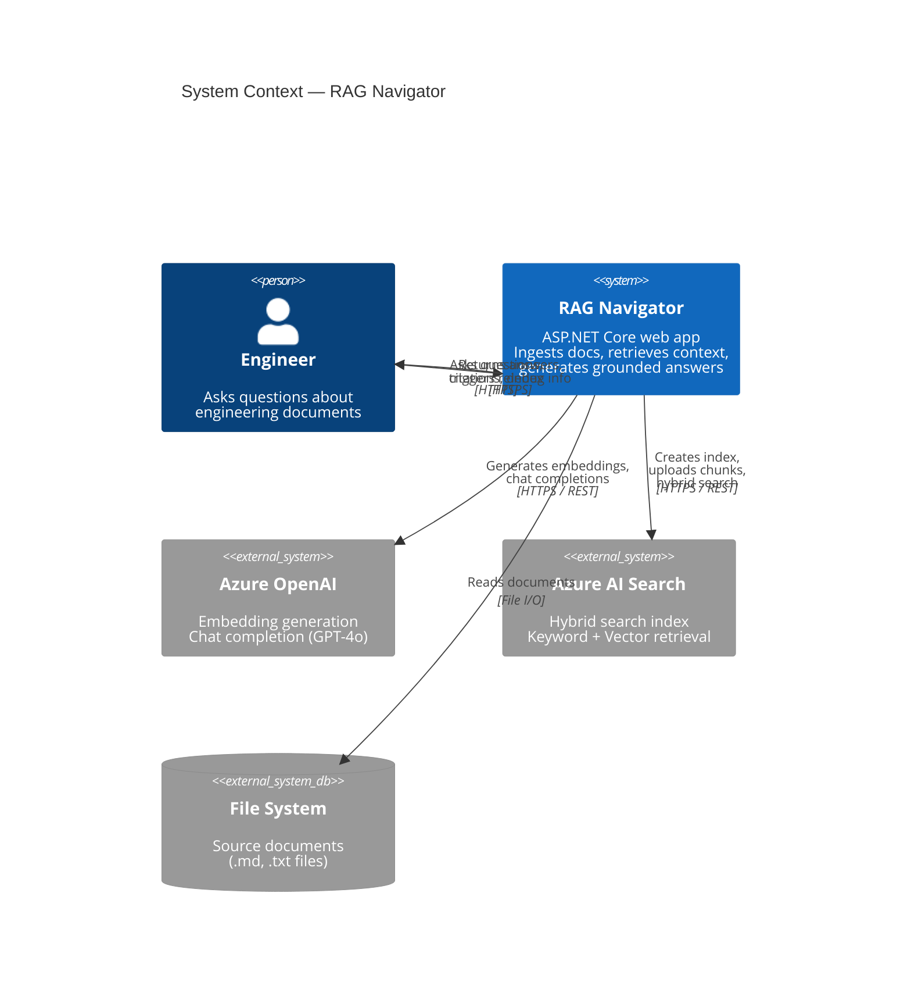

# System Context Diagram

## Overview

The context diagram shows RAG Navigator and its external dependencies from the perspective of the end user. The system has a small trust boundary: it interacts with two Azure services and reads from a local file system.

## Actors

| Actor | Role |
|-------|------|
| **Engineer** | Asks questions, triggers reindexing, views documents and debug info |
| **Azure OpenAI** | Generates embeddings for document chunks and queries; produces grounded answers |
| **Azure AI Search** | Stores and retrieves document chunks using hybrid search (keyword + vector) |
| **File System** | Provides source documents (markdown, text) for ingestion |

## Data Boundaries

- **Inbound:** User questions (plain text, untrusted input). Document files from the local file system (trusted, operator-controlled).
- **Outbound to Azure OpenAI:** Document text (for embedding), user questions + retrieved context (for chat completion). All data sent over HTTPS.
- **Outbound to Azure AI Search:** Document chunks, embeddings, and metadata (for indexing). Search queries and vector queries (for retrieval). All data over HTTPS.
- **To User:** Generated answers, citations, source metadata, and optional debug information.

## Context Diagram

## Trust Boundaries

| Boundary | Description |
|----------|-------------|
| User → App | User input is untrusted. Questions are passed to the LLM inside a structured prompt with grounding instructions. No direct SQL or command execution from user input. |
| App → Azure OpenAI | Document content and user questions are sent to Azure OpenAI. The endpoint is in the customer's Azure tenant. Data processing follows Azure OpenAI data privacy commitments (no training on customer data). |
| App → Azure AI Search | Document chunks and embeddings are stored in the customer's search index. Access is authenticated via API key or managed identity. |
| App → File System | The app reads files from operator-configured directories only. No user-supplied file paths are accepted. |
