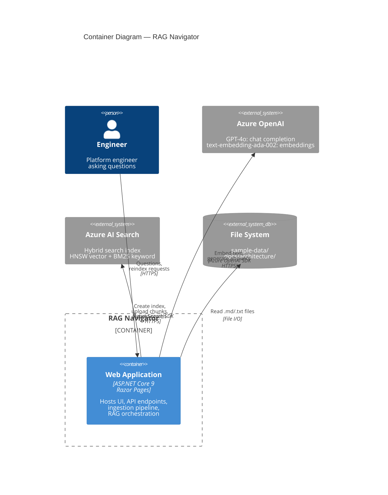

# Container Diagram

## Overview

RAG Navigator is deployed as a single ASP.NET Core application (modular monolith) that communicates with two external Azure services. This diagram shows the container-level architecture — the deployable units and their interactions.

## Containers

| Container | Technology | Responsibility |
|-----------|-----------|---------------|
| **RAG Navigator Web App** | ASP.NET Core 9, Razor Pages | Hosts the UI, API endpoints, and all application logic |
| **Azure OpenAI Service** | Azure-managed (GPT-4o, text-embedding-ada-002) | Embedding generation and chat completion |
| **Azure AI Search** | Azure-managed (Basic/Standard tier) | Document index storage and hybrid retrieval |

## Container Diagram



## Internal Structure of the Web Application

The single deployable unit contains three logical layers:

```
┌─────────────────────────────────────────────┐
│  Web Layer (Razor Pages + Minimal API)      │
│  - Chat UI, Architecture pages              │
│  - POST /api/chat, POST /api/index/reindex  │
│  - GET /api/index/documents                 │
├─────────────────────────────────────────────┤
│  Application Layer                          │
│  - RagOrchestrator, DocumentProcessor       │
│  - MarkdownDocumentChunker, PromptBuilder   │
│  - Interfaces (no Azure dependencies)       │
├─────────────────────────────────────────────┤
│  Infrastructure Layer                       │
│  - AzureOpenAIEmbeddingService              │
│  - AzureOpenAIChatService                   │
│  - AzureSearchIndexService                  │
│  - AzureSearchRetrievalService              │
│  - Configuration + DI registration          │
└─────────────────────────────────────────────┘
```

## Communication Protocols

| From → To | Protocol | Authentication |
|-----------|----------|---------------|
| Engineer → Web App | HTTP/HTTPS | None (demo) |
| Web App → Azure OpenAI | HTTPS (REST) | API key or DefaultAzureCredential |
| Web App → Azure AI Search | HTTPS (REST) | API key or DefaultAzureCredential |
| Web App → File System | Local I/O | OS-level file permissions |

## Hosting Options

| Environment | Hosting | Notes |
|-------------|---------|-------|
| Local dev | `dotnet run` / Kestrel | Direct HTTP, env var configuration |
| Azure (demo) | Azure App Service or Container Apps | HTTPS, managed identity |
| Azure (production) | Container Apps with VNet integration | Private endpoints to Azure services |

## Why a Single Container?

A modular monolith is the right choice for this scope:

- **Fewer moving parts** — no inter-service communication, no service discovery, no distributed tracing overhead.
- **Simpler deployment** — one container, one CI/CD pipeline.
- **Clean internal boundaries** — the three-layer architecture enforces separation of concerns through project references and interfaces, not network calls.
- **Easy to extract** — if a component (e.g., ingestion) needs independent scaling, the interface boundaries make extraction straightforward.

See [ADR-001: Modular Monolith](20-adr-001-modular-monolith.md) for the full decision rationale.
