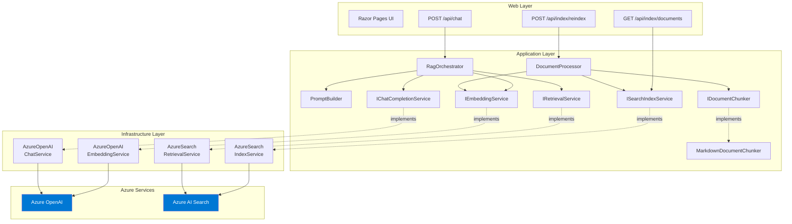

# Component Diagram

## Overview

This diagram details the internal components of the RAG Navigator application, showing how the Application layer interfaces connect to Infrastructure implementations and how the Web layer orchestrates the two primary workflows: document ingestion and question answering.

## Component Diagram



## Component Responsibilities

### Application Layer (No Azure Dependencies)

| Component | Responsibility |
|-----------|---------------|
| **RagOrchestrator** | Orchestrates the full query pipeline: embed query → retrieve → build prompt → generate answer → extract citations |
| **DocumentProcessor** | Orchestrates ingestion: read files → chunk → embed → index |
| **MarkdownDocumentChunker** | Splits markdown documents into semantic chunks on heading boundaries with overlap |
| **PromptBuilder** | Constructs the system and user prompts for grounded generation; parses citations from LLM output |

### Interfaces (Application Layer Contracts)

| Interface | Contract |
|-----------|----------|
| **IDocumentChunker** | `Chunk(content, fileName, title)` → `DocumentChunk[]` |
| **IEmbeddingService** | `GenerateEmbeddingAsync(text)` → `float[]`; batch variant for multiple texts |
| **ISearchIndexService** | `CreateOrUpdateIndexAsync()`, `UploadChunksAsync()`, `DeleteAllDocumentsAsync()`, `GetIndexedDocumentsAsync()` |
| **IRetrievalService** | `SearchAsync(query, queryEmbedding, topK)` → `RetrievalResult[]` |
| **IChatCompletionService** | `GenerateAnswerAsync(systemPrompt, userPrompt)` → `string` |

### Infrastructure Layer (Azure SDK Implementations)

| Component | Azure SDK | Purpose |
|-----------|-----------|---------|
| **AzureOpenAIEmbeddingService** | `Azure.AI.OpenAI` → `EmbeddingClient` | Generates 1536-dimensional vectors for text |
| **AzureOpenAIChatService** | `Azure.AI.OpenAI` → `ChatClient` | Sends grounded prompts to GPT-4o |
| **AzureSearchIndexService** | `Azure.Search.Documents` → `SearchIndexClient` + `SearchClient` | Creates index schema, uploads/deletes documents |
| **AzureSearchRetrievalService** | `Azure.Search.Documents` → `SearchClient` | Executes hybrid (keyword + vector) queries |

## Dependency Flow

```
Web → Application → Infrastructure → Azure SDKs → Azure Services
```

- The Web layer depends on Application (orchestrators) and Infrastructure (DI registration only).
- The Application layer defines interfaces and depends on nothing external.
- The Infrastructure layer implements Application interfaces using Azure SDKs.
- Dependencies flow inward, following the Dependency Inversion Principle.

## Key Design Decisions

1. **Static PromptBuilder:** Prompt construction is a pure function with no state or external dependencies, so it's implemented as a static class for simplicity.
2. **Chunker is synchronous:** Document chunking is CPU-bound string manipulation with no I/O, so `IDocumentChunker` returns synchronously.
3. **Orchestrators are not interfaces:** `RagOrchestrator` and `DocumentProcessor` are concrete classes because they contain the core business logic — they are the "use cases," not infrastructure concerns.
