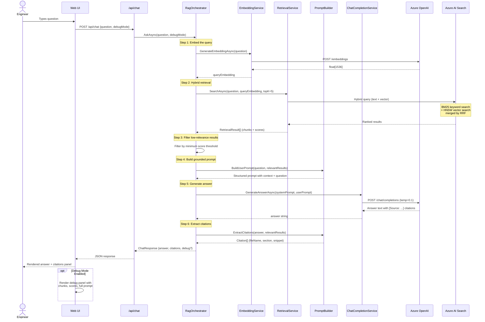

# Query Sequence Diagram

## Overview

This diagram traces the complete lifecycle of a user question through the RAG pipeline, from the UI to the final answer with citations.

## Sequence Diagram

## Latency Breakdown

| Step | Typical Duration | Notes |
|------|-----------------|-------|
| Query embedding | 100-300ms | Single text → 1536-dim vector |
| Hybrid search | 50-150ms | Depends on index size and query complexity |
| Score filtering | < 1ms | In-memory filter |
| Prompt construction | < 1ms | String concatenation |
| LLM generation | 1.5-4s | Dominant latency; depends on answer length |
| Citation extraction | < 1ms | Regex parsing |
| **Total** | **~2-5s** | LLM call is 80-90% of total time |

## Error Handling

| Failure Point | Behavior |
|--------------|----------|
| Embedding call fails | Exception propagates → HTTP 500 → UI shows error message |
| Search call fails | Exception propagates → HTTP 500 → UI shows error message |
| LLM returns empty content | Graceful fallback message about content filtering |
| LLM does not include citations | PromptBuilder falls back to all retrieved chunks as citations |
| No relevant results found | LLM is instructed to say "not enough information" |

## Design Notes

- **Temperature 0.1** is deliberately low to maximize factual grounding. Higher temperatures would produce more creative but less reliable answers.
- **Top-K = 5** balances context richness against prompt token budget. More chunks provide better coverage but increase cost and latency.
- **Minimum relevance threshold** filters out noise from the search results before they reach the LLM, reducing the risk of distraction by irrelevant content.
