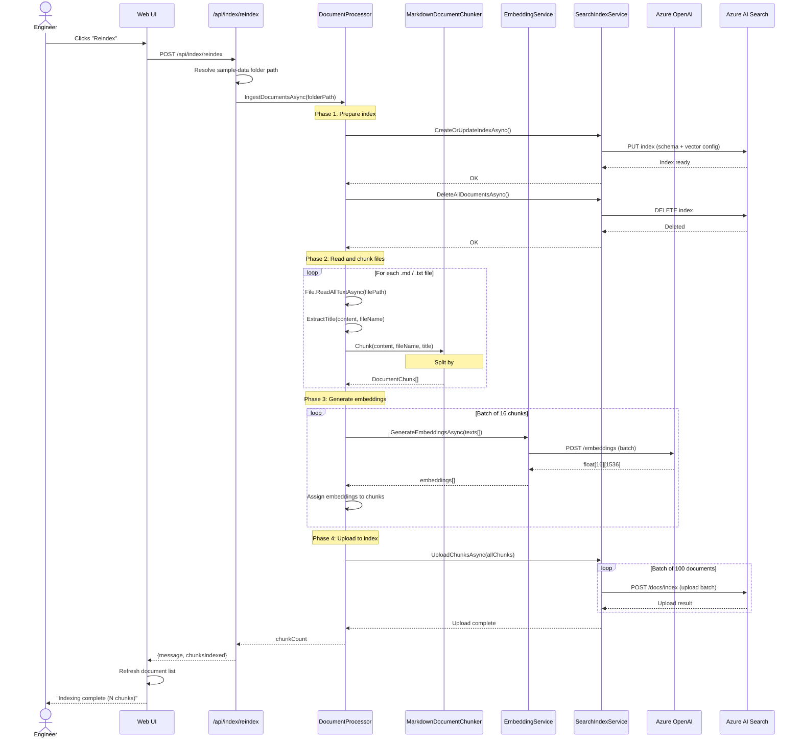

# Ingestion Sequence Diagram

## Overview

This diagram traces the document ingestion pipeline from reading source files through chunking, embedding, and indexing into Azure AI Search.

## Sequence Diagram

## Processing Details

### File Discovery

The processor scans the configured folder(s) for `.md` and `.txt` files, sorted alphabetically. The current implementation scans:
- `sample-data/` — engineering knowledge documents
- `docs/architecture/` — the app's own architecture documentation

### Chunking (per file)

| Parameter | Value | Rationale |
|-----------|-------|-----------|
| Max chunk size | 1,500 characters | Fits comfortably in a single embedding context window |
| Overlap | 200 characters | Preserves cross-boundary context for questions that span sections |
| Min chunk size | 100 characters | Discards fragments too small to be useful for retrieval |
| Heading split | `##` and `###` | Respects semantic section boundaries in markdown |

### Embedding Batching

Azure OpenAI supports batch embedding requests. The processor sends 16 texts per API call to minimize round trips while staying within API limits.

### Index Upload Batching

Azure AI Search supports up to 1,000 documents per upload request. The processor batches uploads in groups of 100 for reliable processing with per-document error reporting.

## Timing Estimates

For the current sample corpus (~7 engineering docs + ~26 architecture docs):

| Phase | Estimated Duration |
|-------|--------------------|
| Read + chunk all files | < 100ms |
| Generate embeddings (~60-80 chunks) | 2-5 seconds |
| Delete + recreate index | 1-2 seconds |
| Upload all chunks | 1-2 seconds |
| **Total** | **~5-10 seconds** |

## Error Scenarios

| Failure | Current Behavior | Production Improvement |
|---------|-----------------|----------------------|
| File read error | Exception stops ingestion | Skip file, log error, continue |
| Embedding API failure | Exception stops ingestion | Retry with exponential backoff |
| Index creation failure | Exception stops ingestion | Retry or alert |
| Upload partial failure | Log warning, continue | Dead-letter failed chunks for retry |

## Idempotency

The reindex operation is idempotent: it deletes the entire index and recreates it from scratch. This means:
- Rerunning produces the same result regardless of prior state.
- There is a brief window where the index is empty (between delete and upload).
- For production, a blue-green index strategy would eliminate this gap.
