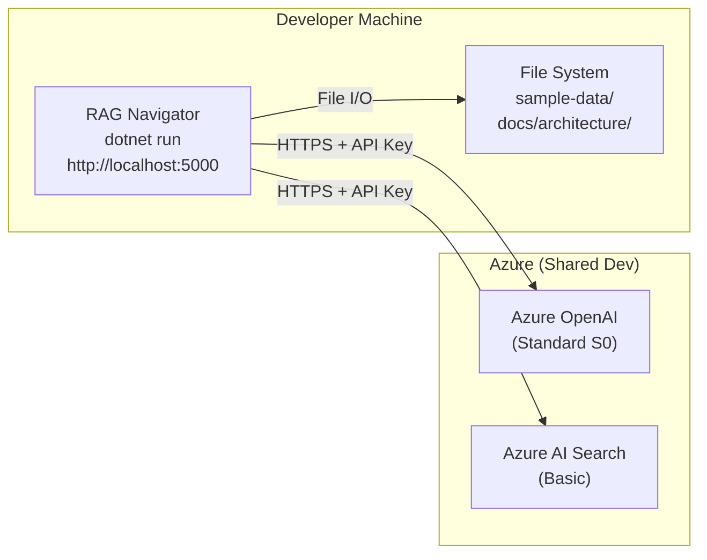
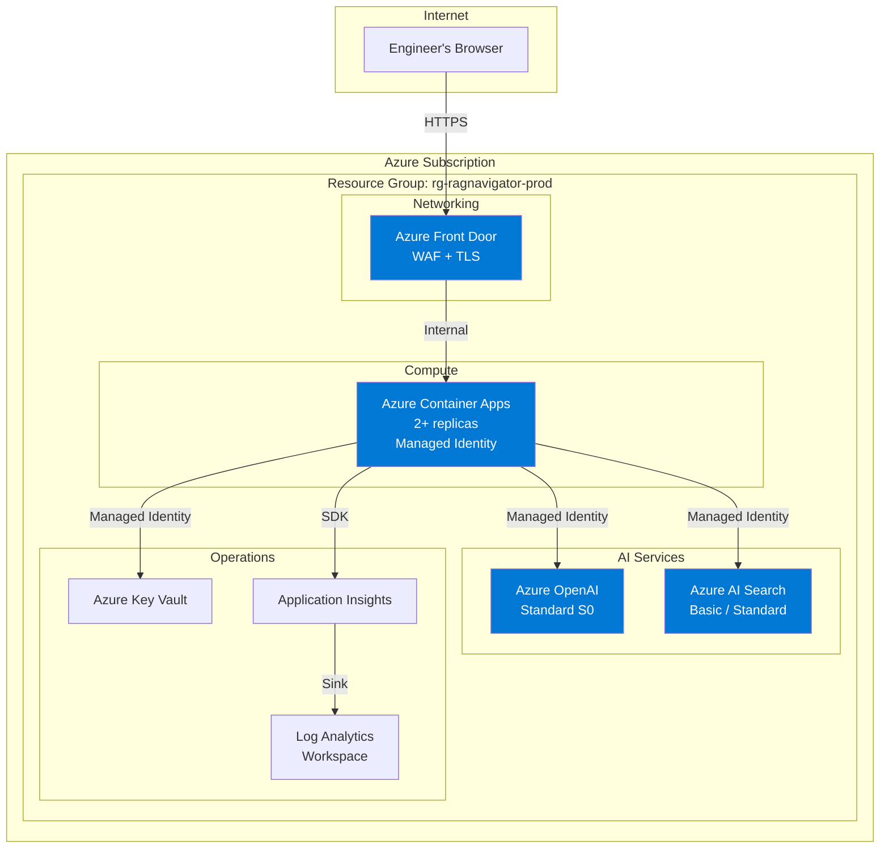
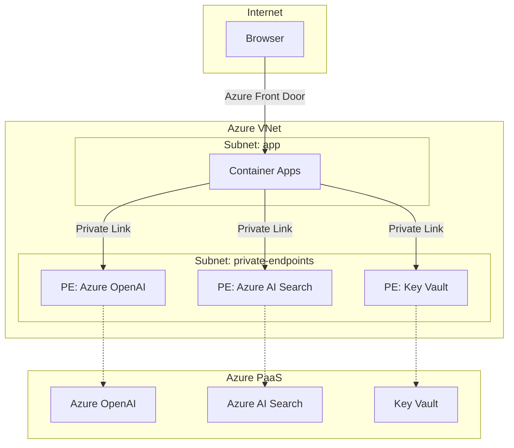

# Deployment Topology

## Local Development Topology

**Authentication:** API keys stored in environment variables.
**Networking:** Direct HTTPS calls to Azure public endpoints.
**Cost:** Azure services are shared; only pay-per-use for OpenAI tokens.

## Azure Deployment Topology (Target)

## Environment Separation

| Environment | Purpose | Azure Services | Auth |
|-------------|---------|----------------|------|
| **Local** | Development and testing | Shared dev Azure OpenAI + Search | API keys in env vars |
| **Dev** | Integration testing | Dedicated dev instances | Managed identity |
| **Staging** | Pre-production validation | Mirrors production config | Managed identity |
| **Production** | Live usage | Full production resources | Managed identity |

Each environment uses its own Azure AI Search index (via the `AZURE_SEARCH_INDEX_NAME` setting) to avoid cross-environment data contamination.

## Network Boundaries

### Current (Demo)

- All communication is over public HTTPS endpoints.
- No VNet, no private endpoints, no network isolation.
- Acceptable for a demo with non-sensitive engineering documents.

### Production Hardening

| Layer | Hardening |
|-------|-----------|
| **Ingress** | Azure Front Door with WAF rules, DDoS protection |
| **Compute → AI** | Private endpoints for Azure OpenAI and Azure AI Search |
| **Compute** | VNet-integrated Container Apps environment |
| **Secrets** | Key Vault with private endpoint, no API keys in config |
| **Egress** | NSG rules restricting outbound to known Azure service IPs |

### Future Network Diagram (Hardened)

## Infrastructure as Code

The current demo does not include IaC templates. For production:

| Tool | Scope |
|------|-------|
| **Bicep** | Azure resource provisioning (preferred for Azure-native) |
| **Terraform** | Alternative for multi-cloud teams |
| **Dockerfile** | Container image build |
| **GitHub Actions** | CI/CD pipeline |

### Minimum IaC Resources

1. Resource Group
2. Azure OpenAI account + model deployments
3. Azure AI Search service
4. Container Apps environment + app
5. Key Vault
6. Application Insights + Log Analytics
7. Managed Identity + RBAC role assignments
