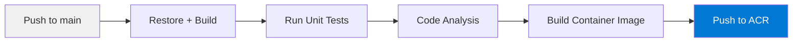
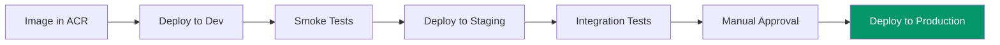

# CI/CD and Release Strategy

## Overview

This document describes the build, test, and release strategy for RAG Navigator. The current demo does not include pipeline definitions, but the design is CI/CD-ready.

## Branching Strategy

**Trunk-based development** with short-lived feature branches:

```
main ─────●──────●──────●──────●──────── (always deployable)
           \    /        \    /
            feat/xyz      fix/abc
```

- `main` is the single source of truth.
- Feature branches are short-lived (1-3 days).
- No long-lived `develop` or `release` branches.
- Tags mark releases: `v1.0.0`, `v1.1.0`.

## Build Pipeline



### Steps

1. **Restore:** `dotnet restore`
2. **Build:** `dotnet build --configuration Release --no-restore`
3. **Test:** `dotnet test --no-build --configuration Release`
4. **Analyze:** Run `dotnet format --verify-no-changes` for style enforcement.
5. **Containerize:** Build Docker image from `src/Web`.
6. **Push:** Push image to Azure Container Registry (ACR).

### Dockerfile Concept

```dockerfile
FROM mcr.microsoft.com/dotnet/sdk:9.0 AS build
WORKDIR /src
COPY . .
RUN dotnet publish src/Web/RAGNavigator.Web.csproj -c Release -o /app

FROM mcr.microsoft.com/dotnet/aspnet:9.0
WORKDIR /app
COPY --from=build /app .
COPY sample-data/ /app/sample-data/
COPY docs/architecture/ /app/docs/architecture/
ENTRYPOINT ["dotnet", "RAGNavigator.Web.dll"]
```

## Release Pipeline



### Environment Promotion

| Environment | Trigger | Validation |
|-------------|---------|-----------|
| **Dev** | Automatic on merge to main | Smoke tests: health check, basic query |
| **Staging** | Automatic after dev passes | Integration tests: reindex, query, verify citations |
| **Production** | Manual approval gate | Verified by staging results |

### Smoke Test (Dev)

```bash
# Wait for deployment
curl --retry 5 --retry-delay 5 $APP_URL/health

# Basic query test
curl -X POST $APP_URL/api/chat \
  -H "Content-Type: application/json" \
  -d '{"question":"What is this system?"}' \
  | jq '.answer' | grep -q "."
```

## Environment Configuration

Each environment uses the same container image with different configuration:

| Setting | Dev | Staging | Production |
|---------|-----|---------|------------|
| `AzureOpenAI:Endpoint` | dev OpenAI endpoint | staging endpoint | prod endpoint |
| `AzureSearch:IndexName` | `rag-nav-dev` | `rag-nav-staging` | `rag-nav-prod` |
| Log level | Debug | Information | Information |
| Auth | API keys | Managed identity | Managed identity |

Configuration is injected via:
- Azure Container Apps environment variables
- Azure Key Vault references (for secrets)

## Rollback Strategy

### Application Rollback

Container Apps supports revision-based traffic splitting:
1. Deploy new revision (0% traffic initially).
2. Route 10% of traffic to new revision (canary).
3. If healthy, shift to 100%.
4. If unhealthy, route 100% back to the previous revision.

```bash
az containerapp revision set-mode --name ragnavigator --resource-group rg-prod --mode multiple
az containerapp ingress traffic set --name ragnavigator --resource-group rg-prod \
  --revision-weight latest=10 previous=90
```

### Index Rollback

If a reindex produces bad results:
1. The previous index data is lost (current delete-and-recreate approach).
2. Re-run indexing with the previous document set.

**Production improvement:** Use a blue-green index strategy:
- Reindex into a new index (`rag-nav-prod-v2`).
- Validate the new index.
- Switch the app configuration to the new index.
- Keep the old index for 24 hours as a rollback target.

## Infrastructure Evolution

| Phase | IaC Approach | Scope |
|-------|-------------|-------|
| Demo (current) | Manual Azure Portal setup | Minimal resources |
| V1 | Bicep templates | Core resources: OpenAI, Search, Container Apps |
| V2 | Bicep + GitHub Actions | Automated provisioning + deployment |
| V3 | Bicep modules + environments | Dev/staging/prod parity |

## Pipeline Tool Choices

| Tool | Rationale |
|------|-----------|
| **GitHub Actions** | Native to GitHub repos, good Azure integration |
| **Azure Container Registry** | Integrated with Container Apps, geo-replication |
| **Bicep** | First-class Azure IaC, simpler than ARM templates |

Alternative: Azure DevOps Pipelines if the team already uses Azure DevOps.
